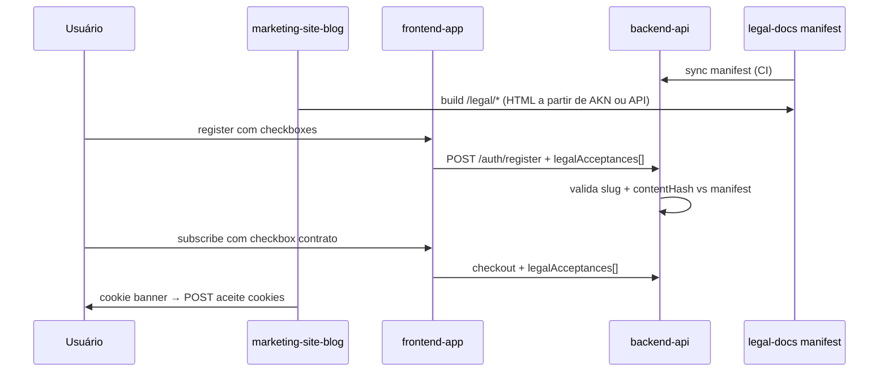

# Especificação Jurídica — Akoma Ntoso 3.0

> **Documento de Engenharia — SaaS Auto Catálogo**  
> **Épico:** [.github#18](https://github.com/saas-auto-catalogo/.github/issues/18)  
> **Repositório fonte:** [legal-docs](https://github.com/saas-auto-catalogo/legal-docs)  
> **Status:** Baseline de governança  
> **Última atualização:** 2026-09-02  

---

## 1. Objetivo

Definir o contrato entre **redação jurídica** (AKN XML no repo `legal-docs`), **publicação** (marketing `/legal/*`) e **consentimento** (register, subscribe, cookies) no produto.

Esta spec não substitui assessoria jurídica; define formato, slugs, versionamento e integração técnica.

---

## 2. Formato e versionamento FRBR

| Aspecto | Valor |
|---------|-------|
| Padrão | Akoma Ntoso 3.0 |
| Tipo de documento | `doc` |
| Namespace | `http://docs.oasis-open.org/legaldocml/ns/akn/3.0` |
| Idioma | `pt-BR` (texto no `mainBody`) |
| Path no repo | `akn/{slug}/{YYYY-MM-DD}.xml` |

### URIs FRBR (padrão fixo)

```
Work:          /akn/br/doc/autocatalogo/{slug}
Expression:    /akn/br/doc/autocatalogo/{slug}/{YYYY-MM-DD}
Manifestation: /akn/br/doc/autocatalogo/{slug}/{YYYY-MM-DD}/xml
```

A data da **Expression** deve coincidir com o nome do arquivo e com `meta/publication/@date`.

### Slugs oficiais

| Slug | Título público | Rota marketing |
|------|------------------|----------------|
| `termos-de-uso` | Termos de Uso | `/legal/termos-de-uso` |
| `politica-de-privacidade` | Política de Privacidade | `/legal/politica-de-privacidade` |
| `politica-de-cookies` | Política de Cookies | `/legal/politica-de-cookies` |
| `contrato-saas` | Contrato SaaS | `/legal/contrato-saas` |
| `aviso-lgpd` | Aviso LGPD | `/legal/aviso-lgpd` |

---

## 3. Contrato `manifest.json`

Gerado pelo CI em `legal-docs` a cada merge em `main`. Consumido por `backend-api` (sync) e `marketing-site-blog` (build-time ou fetch).

```json
{
  "generatedAt": "2026-09-02T12:00:00Z",
  "documents": [
    {
      "slug": "termos-de-uso",
      "title": "Termos de Uso",
      "version": "2026-09-02",
      "frbrWork": "/akn/br/doc/autocatalogo/termos-de-uso",
      "frbrExpression": "/akn/br/doc/autocatalogo/termos-de-uso/2026-09-02",
      "path": "akn/termos-de-uso/2026-09-02.xml",
      "contentHash": "sha256:…",
      "publishedAt": "2026-09-02"
    }
  ]
}
```

| Campo | Descrição |
|-------|-----------|
| `slug` | Identificador estável do documento |
| `version` | Data da Expression (`YYYY-MM-DD`) — versão vigente |
| `contentHash` | SHA-256 do arquivo XML — usado no aceite (`legalAcceptances`) |
| `path` | Caminho relativo no repo |

**Regra:** apenas a **versão mais recente** por slug entra no manifest como vigente. Versões anteriores permanecem no histórico Git.

---

## 4. Outline obrigatório por documento

Cada issue de escrita no `legal-docs` deve cobrir **todas** as seções listadas.

### 4.1 Termos de Uso (`termos-de-uso`)

1. Objeto do serviço (SaaS de catálogo/feeds automotivos)
2. Elegibilidade (B2B, lojistas, capacidade civil)
3. Conta, credenciais e responsabilidade do titular
4. Uso aceitável e conformidade (LGPD, Meta DAA, anti-abuso)
5. Propriedade intelectual (software vs dados do cliente)
6. Limitação de responsabilidade
7. Rescisão e efeitos
8. Foro e lei aplicável (Brasil)

### 4.2 Política de Privacidade (`politica-de-privacidade`)

1. Controlador e encarregado (DPO) — contato
2. Dados coletados (cadastro, workspace, billing, feeds, logs, cookies)
3. Bases legais LGPD por finalidade
4. Finalidades do tratamento
5. Compartilhamento e subprocessadores (Stripe, GCP, Meta, etc.)
6. Retenção e eliminação (incl. expurgo 30d pós-cancelamento — ver [RNFs § LGPD](non-functional-requirements-sla.md))
7. Direitos do titular (art. 18)
8. Canal para exercício de direitos

### 4.3 Política de Cookies (`politica-de-cookies`)

1. Definição de cookies e tecnologias similares
2. Tipos: essenciais, analíticos, marketing (se aplicável)
3. Tabela: nome, finalidade, duração, primeiro/terceiro
4. Como gerenciar (banner, navegador)
5. Link para Política de Privacidade

### 4.4 Contrato SaaS (`contrato-saas`)

1. Planos e preços (Starter, Pro, Agency)
2. Trial 14 dias (condições — alinhado a [.github#14](https://github.com/saas-auto-catalogo/.github/issues/14))
3. Faturamento, Stripe, renovação, inadimplência
4. SLA 99.9% (referência RNFs)
5. Suporte
6. Alteração de termos e preços (aviso prévio)
7. Cancelamento e efeitos

### 4.5 Aviso LGPD (`aviso-lgpd`)

1. Resumo dos direitos do titular
2. Como exercer (formulário/e-mail)
3. Prazo de resposta
4. Encarregado (DPO)
5. Reclamação à ANPD

---

## 5. Fluxo de aceite no produto



### 5.1 Pontos de consentimento

| Momento | Documentos obrigatórios | Repo issue |
|---------|-------------------------|------------|
| **Register** | `termos-de-uso`, `politica-de-privacidade` | frontend-app |
| **Subscribe / checkout** | `contrato-saas` | frontend-app |
| **Cookie banner** | `politica-de-cookies` (informar + opt-in analíticos) | marketing-site-blog |

### 5.2 Payload `legalAcceptances` (contrato API — backend)

```json
{
  "legalAcceptances": [
    {
      "slug": "termos-de-uso",
      "version": "2026-09-02",
      "contentHash": "sha256:…",
      "acceptedAt": "2026-09-02T21:00:00Z"
    }
  ]
}
```

O backend **rejeita** register/checkout se hash ou versão não corresponder ao manifest vigente.

### 5.3 Microcopy (W6)

Textos curtos do banner de cookies e labels dos checkboxes ficam em issue dedicada; não fazem parte do AKN XML.

---

## 6. Referências LGPD (RNFs)

Ver [non-functional-requirements-sla.md](non-functional-requirements-sla.md):

- TLS 1.3, AES-256 em repouso
- AuditLog de operações sensíveis
- Expurgo de dados 30 dias após cancelamento
- Direitos do titular e canal DPO

A Política de Privacidade e o Aviso LGPD devem refletir esses compromissos técnicos.

---

## 7. Dependências e bloqueios

```
Escrita W1–W5 (v1 mergeada)
  → CI manifest (legal-docs)
  → API LegalDocument / LegalAcceptance (backend-api)
  → Register + Subscribe consent (backend + frontend)
  → Páginas /legal/* + footer (marketing)
  → Cookie banner (marketing)
  → Smoke E2E (.github)
```

**Bloqueio:** issues de produto (páginas, consent) não fecham sem **pelo menos v1** de W1–W5 mergeados em `legal-docs/main`.

**Paralelo:** W1–W2 devem preceder ou correr em paralelo com trial [.github#14](https://github.com/saas-auto-catalogo/.github/issues/14) — register exige termos + privacidade.

---

## 8. Posição na pipeline

```
#16 comercial (concluído) → #14 trial → #18 jurídico → go-live
```

Épico pai de produto: [.github#12 Fase 11/12](https://github.com/saas-auto-catalogo/.github/issues/12)
