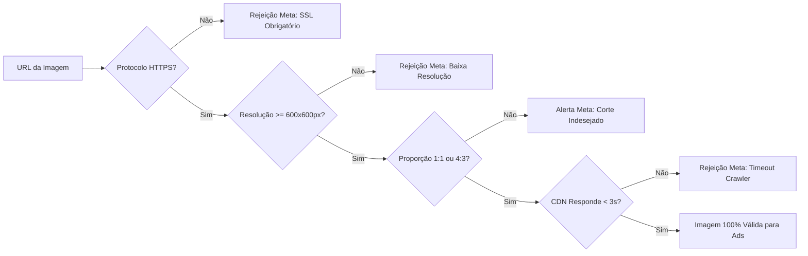

# 🚗 Especificação Técnica do Feed Meta Automotive Inventory Ads (DAA)

> **Documento de Especificação Técnica — SaaS Auto Catálogo**  
> **Referência:** Issue [#3 - [Task][Specs] Especificação Técnica do Catálogo Meta Automotive Inventory Ads (DAA)](https://github.com/saas-auto-catalogo/.github/issues/3)  
> **Status:** Aprovado / Baseline de Engenharia  
> **Última Atualização:** 2026-08-31  

---

## 1. Visão Geral e Arquitetura do Feed Meta DAA

O **Meta Automotive Inventory Ads (DAA)** é o formato padrão da Meta (Facebook e Instagram) para campanhas dinâmicas de catálogo automotivo. O Meta Commerce Manager ingere feeds de inventário periodicamente (via HTTP GET agendado) para criar criativos personalizados baseados nos veículos em estoque e no comportamento do usuário (páginas visitadas, buscas por marca/modelo/faixa de preço).

### 1.1. Endpoint Público de Distribuição
O `backend-api` expõe o feed público com segurança por token individual para cada revenda:
```http
GET /api/v1/feeds/:token/meta-vehicles.xml HTTP/1.1
Host: api.autocatalogo.com.br
Accept: application/xml, text/xml, */*
Accept-Encoding: gzip, deflate, br
```

### 1.2. Requisitos Não-Funcionais (RNFs) do Endpoint
- **Latência Alvo**: `< 800ms` para catálogos com até 2.000 veículos.
- **Estratégia de Cache**: Redis em memória com chave `feed:meta:${feedTokenHash}` e TTL de 15 minutos (com invalidação instantânea disparada pela Diff Engine após sincronizações de estoque).
- **Compressão**: Suporte obrigatório a compressão `GZIP` com cabeçalho `Content-Encoding: gzip`.
- **Cabeçalhos HTTP**:
  - `Content-Type: application/xml; charset=UTF-8`
  - `Cache-Control: public, max-age=900, stale-while-revalidate=300`
  - `ETag: "sha256-hash-do-conteudo"`

---

## 2. Estrutura e Formato do XML

O catálogo de veículos da Meta utiliza o formato XML RSS 2.0 com extensões de namespace automotivo (`xmlns:g="http://base.google.com/ns/1.0"` e tags nativas do Meta Automotive).

```xml
<?xml version="1.0" encoding="UTF-8"?>
<feed xmlns="http://www.w3.org/2005/Atom" xmlns:g="http://base.google.com/ns/1.0">
  <title>Catálogo de Veículos - Nome da Revenda</title>
  <link rel="self" href="https://api.autocatalogo.com.br/api/v1/feeds/TOKEN/meta-vehicles.xml" />
  <updated>2026-08-31T18:00:00Z</updated>

  <!-- Cada veículo em estoque é representado por um elemento <entry> -->
  <entry>
    <g:vehicle_id>CANONICAL_ID_OU_EXTERNAL_ID</g:vehicle_id>
    <g:title>Mercedes-Benz GLC 300 2.0 MHEV AMG Line Coupé 2025/2026</g:title>
    <g:description>Mercedes-Benz GLC 300 AMG Line Coupé com 4.686 km, motor turbo de 258 cv...</g:description>
    <g:url>https://www.revenda.com.br/veiculo/mercedes-benz-glc-300-2025</g:url>
    <g:image_link>https://cdn.revenda.com.br/fotos/glc300_capa.jpg</g:image_link>
    <g:price>489700.00 BRL</g:price>
    <g:availability>in stock</g:availability>
    <g:make>Mercedes-Benz</g:make>
    <g:model>GLC 300</g:model>
    <g:year>2026</g:year>
    <g:mileage>
      <g:value>4686</g:value>
      <g:unit>KM</g:unit>
    </g:mileage>
    <g:vin>9BWCA45U8LP019284</g:vin>
    <g:state_of_vehicle>used</g:state_of_vehicle>

    <!-- Atributos Opcionais Recomendados -->
    <g:body_style>suv</g:body_style>
    <g:transmission>automatic</g:transmission>
    <g:fuel_type>hybrid</g:fuel_type>
    <g:exterior_color>Preto</g:exterior_color>
    <g:doors>4</g:doors>
    <g:drivetrain>awd</g:drivetrain>
    <g:dealer_id>REV-1042</g:dealer_id>
    <g:dealer_name>Auto Shopping Motors</g:dealer_name>
    <g:dealer_phone>+5511999998888</g:dealer_phone>
    <g:custom_label_0>Preço Acima 300k</g:custom_label_0>
    <g:custom_label_1>Eletrificado</g:custom_label_1>
    <g:custom_label_2>Pronta Entrega</g:custom_label_2>
  </entry>
</feed>
```

---

## 3. Matriz de Atributos do Meta DAA

### 3.1. Atributos Obrigatórios (Mandatory)

A ausência ou inconsistência de qualquer um destes campos causa a **rejeição imediata do item** no Meta Commerce Manager:

| Tag XML Meta | Tipo de Dado | Restrições & Validações | Origem no `CanonicalVehicle` | Exemplo |
|---|---|---|---|---|
| `<g:vehicle_id>` | `string` | ID único, imutável e estável. Máx 100 caracteres. Sem espaços. | `externalId` ou `id` | `mercedes-benz-glc-300-2025` |
| `<g:title>` | `string` | Título do anúncio. Máx 150 caracteres. Não usar ALL CAPS no título inteiro (exceto marcas). | `title` | `Porsche 911 Sport Classic 2023` |
| `<g:description>` | `string` | Descrição limpa. Máx 5.000 caracteres. Proibido código HTML ou scripts. | `description` | `Unidade numerada 537 de 1.250 com motor 550 cv...` |
| `<g:url>` | `string (URI)` | Deep link da página do veículo no site da revenda. Deve iniciar com `https://`. | `canonicalUrl` | `https://revenda.com.br/veiculo/911-2023` |
| `<g:image_link>` | `string (URI)` | URL pública da foto de capa. `https://` obrigatório. Resolução mínima 600x600px. | `heroImageUrl` \|\| `images[0].url` | `https://cdn.revenda.com.br/foto1.jpg` |
| `<g:price>` | `string` | Preço numérico + código ISO `BRL`. Valor deve ser estritamente `> 0`. | `pricing.price` formatado | `489700.00 BRL` |
| `<g:availability>` | `string (enum)` | `in stock`, `out of stock`, `available for order`. | `status === 'AVAILABLE' ? 'in stock' : 'out of stock'` | `in stock` |
| `<g:make>` | `string` | Marca/Fabricante do veículo. | `make` | `Porsche` |
| `<g:model>` | `string` | Nome do modelo principal. | `model` | `911` |
| `<g:year>` | `integer` | Ano de 4 dígitos (`1900-2100`). Usar `modelYear`. | `modelYear` | `2024` |
| `<g:mileage>` | `object` | Contém `<g:value>` (inteiro >= 0) e `<g:unit>` (`KM` para Brasil). | `mileage` e `'KM'` | `<g:value>17881</g:value><g:unit>KM</g:unit>` |
| `<g:vin>` | `string` | Chassi (17 caracteres) ou identificador único para veículos sem chassi explícito. | `vin` \|\| `externalId` | `9BWCA45U8LP019284` |
| `<g:state_of_vehicle>` | `string (enum)` | `new`, `used`, `cpo` (Certified Pre-Owned). | `condition === 'NOVO' ? 'new' : 'used'` | `used` |

---

### 3.2. Atributos Opcionais Recomendados (Enrichment)

Campos opcionais que aumentam a relevância dos anúncios dinâmicos e permitem segmentações granulares em campanhas:

| Tag XML Meta | Valores Aceitos pela Meta | Origem no `CanonicalVehicle` | Exemplo |
|---|---|---|---|
| `<g:sale_price>` | Numérico + `BRL` (quando houver desconto) | `pricing.promotionalPrice` | `119900.00 BRL` |
| `<g:body_style>` | `convertible`, `coupe`, `hatchback`, `minivan`, `pickup`, `sedan`, `suv`, `van`, `wagon`, `other` | `bodyStyle.toLowerCase()` | `suv` |
| `<g:transmission>` | `automatic`, `manual`, `other` | `transmission === 'MANUAL' ? 'manual' : 'automatic'` | `automatic` |
| `<g:fuel_type>` | `diesel`, `electric`, `flex`, `gasoline`, `hybrid`, `plugin_hybrid`, `other` | `fuelType` mapeado para enum Meta | `plugin_hybrid` |
| `<g:exterior_color>` | Nome da cor em português | `colors.exteriorBase` \|\| `colors.exterior` | `Preto` |
| `<g:interior_color>` | Cor interna / estofamento | `colors.interior` | `Couro Preto` |
| `<g:doors>` | Quantidade de portas (inteiro) | `doors` | `4` |
| `<g:drivetrain>` | `4wd`, `awd`, `fwd`, `rwd` | `drivetrain.toLowerCase()` | `awd` |
| `<g:additional_image_link>` | Múltiplas URLs de fotos secundárias | `images[1..N].url` | `https://cdn.revenda.com.br/foto2.jpg` |
| `<g:dealer_id>` | Identificador da revenda / filial | `workspaceId` ou código interno | `REV-1042` |
| `<g:dealer_name>` | Razão social / nome fantasia | Nome da Revenda | `Auto Shopping Motors` |
| `<g:dealer_phone>` | Telefone com DDI e DDD no formato E.164 | Telefone do tenant | `+5511999998888` |
| `<g:fb_page_id>` | ID numérico da Página do Facebook | Configuração de integração Meta | `102938475610293` |
| `<g:custom_label_0>` | String livre (Faixa de Preço) | Ex: `Ate 100k`, `100k a 200k`, `Acima 200k` | `Acima 200k` |
| `<g:custom_label_1>` | String livre (Blindagem) | `armored ? 'Blindado' : 'Convencional'` | `Blindado` |
| `<g:custom_label_2>` | String livre (Eletrificação) | `fuelType in [ELETRICO, HIBRIDO, HIBRIDO_PLUG_IN] ? 'Eletrificado' : 'Combustao'` | `Eletrificado` |
| `<g:custom_label_3>` | String livre (Condição/Garantia) | `hasWarranty ? 'Com Garantia' : 'Sem Garantia'` | `Com Garantia` |
| `<g:custom_label_4>` | String livre (Segmento/Carroceria) | `bodyStyle` | `SUV` |

---

## 4. Regras e Validações de Imagens

O Meta Commerce Manager realiza checagem automatizada nas imagens dos anúncios:



### 4.1. Diretrizes Técnicas de Imagens
1. **Resolução Mínima**: `600 x 600 pixels`. Resolução recomendada: `1080 x 1080 pixels` (1:1) ou `1200 x 628 pixels` (1.91:1) ou `1080 x 1350 pixels` (4:5).
2. **Proporção (Aspect Ratio)**:
   - Formato Quadrado: `1:1` (ideal para carrossel do feed do Instagram e Facebook).
   - Formato Retangular Paisagem: `4:3` ou `1.91:1` (ideal para feed horizontal e Stories).
3. **Formatos de Arquivo Suportados**: `JPEG (.jpg, .jpeg)`, `PNG (.png)`, `WebP (.webp)`.
4. **Tamanho de Arquivo**: Máximo de `8 MB` por imagem.
5. **HTTPS Estrito**: URLs `http://` são sumariamente rejeitadas pelo validador da Meta.
6. **Políticas de Conteúdo do Anúncio**:
   - Evitar marcas d'água com texto cobrindo mais de 20% da imagem.
   - Proibido uso de imagens de placeholders ("Foto em breve", "Imagem indisponível").

---

## 5. Regras de Precificação e Condições Comerciais

### 5.1. Formato Monetário
- Moeda: Estritamente **`BRL`** para contas de anúncio brasileiras.
- Formatação no XML: `<g:price>489700.00 BRL</g:price>`.
- O valor deve ser um número decimal positivo com ponto como separador decimal e exatamente 2 casas decimais, seguido de um espaço e o código da moeda.

### 5.2. Regra de Descarte e Elegibilidade
- **Preço Sob Consulta (`priceOnRequest: true`)**: Itens cadastrados sem valor explícito **NÃO são exportados** no feed Meta DAA.
- **Preço Zerado ou Negativo (`price <= 0`)**: **NÃO são exportados**.
- **Veículos Vendidos (`status: 'SOLD'`)**: Devem ser emitidos com `<g:availability>out of stock</g:availability>` ou removidos do feed caso a revenda prefira focar orçamento apenas em estoque ativo.

---

## 6. Mapeamento dos Enums Canônicos para Enums da Meta

### 6.1. Combustível (`FuelType` -> Meta `fuel_type`)
```typescript
function mapFuelTypeToMeta(fuelType: FuelType): string {
  switch (fuelType) {
    case FuelType.FLEX:
    case FuelType.ETANOL:
      return 'flex';
    case FuelType.GASOLINA:
      return 'gasoline';
    case FuelType.DIESEL:
      return 'diesel';
    case FuelType.ELETRICO:
      return 'electric';
    case FuelType.HIBRIDO:
    case FuelType.MHEV_HIBRIDO_LEVE:
      return 'hybrid';
    case FuelType.HIBRIDO_PLUG_IN:
      return 'plugin_hybrid';
    default:
      return 'other';
  }
}
```

### 6.2. Câmbio (`TransmissionType` -> Meta `transmission`)
```typescript
function mapTransmissionToMeta(transmission: TransmissionType): string {
  switch (transmission) {
    case TransmissionType.MANUAL:
      return 'manual';
    case TransmissionType.AUTOMATICO:
    case TransmissionType.DUPLA_EMBREAGEM:
    case TransmissionType.CVT:
    case TransmissionType.AUTOMATIZADO:
    case TransmissionType.SEMI_AUTOMATICO:
      return 'automatic';
    default:
      return 'other';
  }
}
```

### 6.3. Carroceria (`BodyStyle` -> Meta `body_style`)
```typescript
function mapBodyStyleToMeta(bodyStyle: BodyStyle): string {
  const map: Record<BodyStyle, string> = {
    [BodyStyle.SUV]: 'suv',
    [BodyStyle.SEDAN]: 'sedan',
    [BodyStyle.HATCHBACK]: 'hatchback',
    [BodyStyle.COUPE]: 'coupe',
    [BodyStyle.CONVERTIBLE]: 'convertible',
    [BodyStyle.PICKUP]: 'pickup',
    [BodyStyle.MINIVAN]: 'minivan',
    [BodyStyle.VAN]: 'van',
    [BodyStyle.WAGON]: 'wagon',
    [BodyStyle.COMMERCIAL]: 'other',
    [BodyStyle.MOTORCYCLE]: 'other',
    [BodyStyle.OTHER]: 'other'
  };
  return map[bodyStyle] || 'other';
}
```
