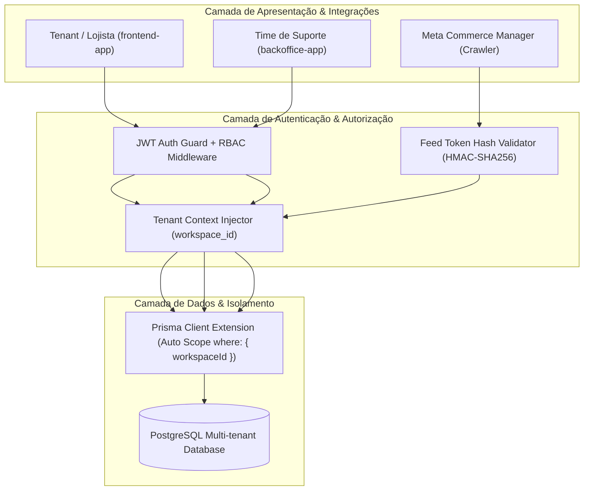
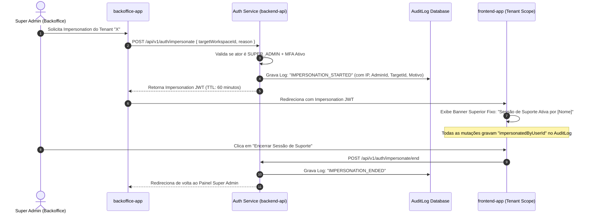
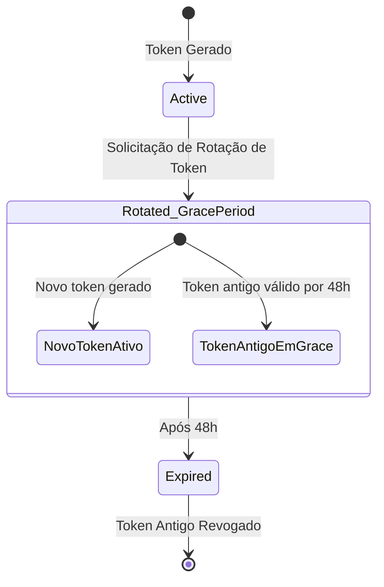

# 🛡️ Especificação de Multi-Tenancy, Isolamento de Workspaces, RBAC e Segurança de Feeds

> **Documento de Especificação Técnica — DriveSync (SaaS Auto Catálogo)**  
> **Referência:** Issue [#4 - [Task][Specs] Modelagem de Multi-Tenancy, Isolamento de Workspaces e RBAC](https://github.com/saas-auto-catalogo/.github/issues/4)  
> **Status:** Aprovado / Baseline de Engenharia  
> **Última Atualização:** 2026-08-31  

---

## 1. Arquitetura de Multi-Tenancy e Segregação de Dados

O **DriveSync** adota a arquitetura de **Shared Database, Shared Schema com Segregação Lógica por `workspace_id`**, garantindo alta eficiência no uso de recursos computacionais, facilidade de migração e manutenção, aliada a rigorosas garantias de isolamento de dados entre diferentes concessionárias e revendas.



---

## 2. Princípios de Isolamento e Modelagem de Dados

### 2.1. Regra de Ouro da Segregação por `workspace_id`
Todas as tabelas que armazenam dados pertencentes a uma revenda ou concessionária **devem obrigatoriamente possuir a coluna `workspace_id` (UUID v4)** como chave estrangeira indexada:
1. `vehicles`
2. `feed_configs`
3. `feed_sync_logs`
4. `catalog_exports`
5. `workspace_members`
6. `audit_logs`
7. `subscriptions`

### 2.2. Índices Compostos e Constraints de Unicidade
Para evitar gargalos de performance e prevenir colisões de identificadores entre diferentes revendas:
- **Unicidade de Veículos por Workspace**:
  ```sql
  CREATE UNIQUE INDEX uq_vehicles_workspace_external_id ON vehicles (workspace_id, external_id);
  ```
  *Garante que o mesmo ID de estoque de revendas distintas possa coexistir sem conflito no banco global.*
- **Índices de Alta Performance para Consultas e Feeds**:
  ```sql
  CREATE INDEX idx_vehicles_workspace_status ON vehicles (workspace_id, status);
  CREATE INDEX idx_vehicles_workspace_updated_at ON vehicles (workspace_id, updated_at DESC);
  CREATE INDEX idx_feed_sync_logs_workspace_created ON feed_sync_logs (workspace_id, created_at DESC);
  CREATE INDEX idx_audit_logs_workspace_created ON audit_logs (workspace_id, created_at DESC);
  ```

### 2.3. Isolamento Automático via Prisma Client Extensions
Para eliminar o risco humano de esquecimento de cláusulas `where: { workspaceId }` nas consultas do `backend-api`, o Prisma Client é estendido com um middleware de escopo automático:

```typescript
// Exemplo de extensão do Prisma para injeção automática de workspaceId
export const tenantPrisma = (workspaceId: string) => {
  return prisma.$extends({
    query: {
      vehicle: {
        async findMany({ args, query }) {
          args.where = { ...args.where, workspaceId };
          return query(args);
        },
        async findFirst({ args, query }) {
          args.where = { ...args.where, workspaceId };
          return query(args);
        },
        async create({ args, query }) {
          args.data = { ...args.data, workspaceId };
          return query(args);
        }
      }
    }
  });
};
```

---

## 3. Matriz de Controle de Acesso Baseado em Papéis (RBAC)

O sistema define quatro papéis com responsabilidades e privilégios estritamente delimitados:

### 3.1. Definição dos Papéis (`RoleEnum`)
1. **`SUPER_ADMIN` (Equipe Interna do DriveSync - Backoffice)**:
   - Acesso cross-tenant irrestrito ao painel `backoffice-app`.
   - Gestão de planos, faturamento global, infraestrutura de feeds e métricas operacionais.
   - Capacidade de executar **Impersonation** auditado em contas de clientes.
2. **`OWNER` (Proprietário / Sócio da Revenda - Tenant Admin)**:
   - Acesso irrestrito ao seu próprio workspace no `frontend-app`.
   - Convite e remoção de membros da equipe, alteração de dados cadastrais, gestão de faturamento e planos.
   - Geração e rotação de tokens de feed do catálogo Meta.
3. **`MANAGER` (Gestor de Tráfego / Gerente de Estoque / Agência Parceira)**:
   - Operação do dia a dia do catálogo: configuração de URLs de feeds de estoque, mapeamento de opcionais, execução manual de sincronizações, simulação de anúncios e visualização de métricas de catálogo.
   - **Sem acesso** a faturamento, cancelamento de conta ou exclusão do workspace.
4. **`VIEWER` (Apenas Leitura / Vendedor / Auditor)**:
   - Visualização do estoque sincronizado, status dos feeds e relatórios.
   - **Sem permissão** para disparar sincronizações, alterar configurações de feed ou convidar usuários.

---

### 3.2. Matriz Exaustiva de Permissões

| Recurso / Ação | Permissão Granular | `SUPER_ADMIN` | `OWNER` | `MANAGER` | `VIEWER` |
|---|---|:---:|:---:|:---:|:---:|
| **Workspaces & Tenants** | | | | | |
| Visualizar dados da Revenda | `workspace:read` | ✅ | ✅ | ✅ | ✅ |
| Atualizar Razão Social, CNPJ, Telefone | `workspace:update` | ✅ | ✅ | ❌ | ❌ |
| Excluir Workspace / Cancelar Conta | `workspace:delete` | ✅ | ✅ | ❌ | ❌ |
| **Membros & Equipe** | | | | | |
| Listar membros do Workspace | `members:read` | ✅ | ✅ | ✅ | ❌ |
| Convidar novos membros | `members:invite` | ✅ | ✅ | ❌ | ❌ |
| Alterar papel de membros (RBAC) | `members:update_role`| ✅ | ✅ | ❌ | ❌ |
| Remover membro do Workspace | `members:remove` | ✅ | ✅ | ❌ | ❌ |
| **Feeds de Estoque (DMS)** | | | | | |
| Visualizar configurações e URLs de feeds | `feed:read` | ✅ | ✅ | ✅ | ✅ |
| Cadastrar / Editar URL de Feed (AutoCerto, etc.) | `feed:configure` | ✅ | ✅ | ✅ | ❌ |
| Disparar Sincronização Manual | `feed:sync_now` | ✅ | ✅ | ✅ | ❌ |
| Ver Logs Detalhados de Sincronização & Diff | `feed:view_logs` | ✅ | ✅ | ✅ | ✅ |
| **Catálogo Meta DAA** | | | | | |
| Visualizar URL do Feed Meta e Instruções | `catalog:read` | ✅ | ✅ | ✅ | ✅ |
| Rotacionar Token do Feed Meta | `catalog:rotate_token`| ✅ | ✅ | ✅ | ❌ |
| Simular Anúncios Dinâmicos / Criativos | `catalog:simulate` | ✅ | ✅ | ✅ | ✅ |
| **Financeiro & Assinaturas** | | | | | |
| Visualizar Plano e Faturas | `billing:read` | ✅ | ✅ | ❌ | ❌ |
| Alterar Plano / Cartão de Crédito | `billing:manage` | ✅ | ✅ | ❌ | ❌ |
| **Auditoria & Segurança** | | | | | |
| Visualizar Trilha de Auditoria (`AuditLog`) | `audit:read` | ✅ | ✅ | ❌ | ❌ |
| **Backoffice & Suporte** | | | | | |
| Iniciar Sessão de Impersonation | `support:impersonate` | ✅ | ❌ | ❌ | ❌ |
| Gerenciar Tenants Globais | `backoffice:manage_all`| ✅ | ❌ | ❌ | ❌ |

---

## 4. Fluxo Seguro de Impersonation (Suporte ao Cliente)

O **Impersonation** permite que engenheiros de suporte ou administradores operem temporariamente a conta de uma revenda para diagnosticar problemas de integração de feeds ou prestar auxílio técnico.



### 4.1. Regras Estritas de Segurança no Impersonation
1. **MFA Obrigatório**: O Super Admin deve possuir autenticação de dois fatores (TOTP) validada na sessão.
2. **Claims do JWT Efêmero**:
   ```json
   {
     "sub": "user_id_do_owner_alvo",
     "workspaceId": "target_workspace_uuid",
     "role": "OWNER",
     "isImpersonated": true,
     "impersonatedByUserId": "super_admin_uuid",
     "impersonationReason": "Diagnóstico de falha na ingestão do XML AutoCerto",
     "iat": 1756660000,
     "exp": 1756663600
   }
   ```
3. **Banner Visual Indestrutível**: O `frontend-app` renderiza uma barra de aviso vermelha no topo da página informando que a sessão está sendo executada pelo suporte, com botão para encerrar a qualquer momento.
4. **Ações Proibidas em Impersonation**:
   - Alteração de senha, e-mail ou dados de login do usuário real.
   - Exclusão do workspace ou alteração de dados bancários/cartão de crédito.
5. **Trilha de Auditoria Síncrona**: Toda operação de escrita realizada durante o impersonation registra tanto o `workspaceId` quanto o `impersonatedByUserId` no `AuditLog`.

---

## 5. Política de Segurança e Autenticação de Endpoints de Feed

Os endpoints públicos de catálogos da Meta (ex: `/api/v1/feeds/:token/meta-vehicles.xml`) precisam ser acessíveis pelo crawler automatizado da Meta sem autenticação HTTP básica (Basic Auth). A segurança é garantida por **Tokens Criptográficos de Alta Entropia e Hashing Seguro**.

### 5.1. Estrutura do Token de Feed
- **Prefixo Identificador**: `feed_tok_`
- **Entropia**: 32 bytes aleatórios codificados em base64 URL-safe (256 bits de entropia).
- **Exemplo de Token Público**:
  `feed_tok_9F8aB2cD3eF4gH5iJ6kL7mN8oP9qR0sT1uV2wX3yZ4`

### 5.2. Armazenamento Seguro com Hash SHA-256 + Salt
Para proteger a integridade dos feeds mesmo em caso de dump não autorizado do banco de dados:
- O token em texto claro **nunca é armazenado no banco**.
- Ao ser gerado, o token é exibido uma única vez ao usuário e armazenado como hash SHA-256 com salt individual:
  ```typescript
  import crypto from 'crypto';

  export function hashFeedToken(rawToken: string, salt: string): string {
    return crypto.createHmac('sha256', salt).update(rawToken).digest('hex');
  }
  ```

### 5.3. Rotação de Tokens com Zero Downtime (Janela de Transição de 48h)
Quando o lojista solicita a rotação do token de feed (por exemplo, após troca de agência de marketing):
1. Um **novo token ativo (`activeToken`)** é gerado imediatamente.
2. O token antigo é movido para **`previousToken`** com uma data de expiração de **48 horas**.
3. Durante esse período de 48 horas, requisições vindas do Meta Catalog com o token antigo continuam sendo atendidas com sucesso, evitando que os anúncios entrem em pausa antes que o gestor atualize a URL no Meta Commerce Manager.
4. Após 48 horas, o `previousToken` é revogado definitivamente.



### 5.4. Proteção contra Scraping Abusivo e Rate Limiting
- **Rate Limit por IP**: Máximo de 120 requisições por minuto por IP para endpoints públicos de feed.
- **Cache-Control Estrito**: Respostas cacheadas com `ETag` para que o crawler da Meta receba `HTTP 304 Not Modified` quando o inventário não sofrer alterações.
