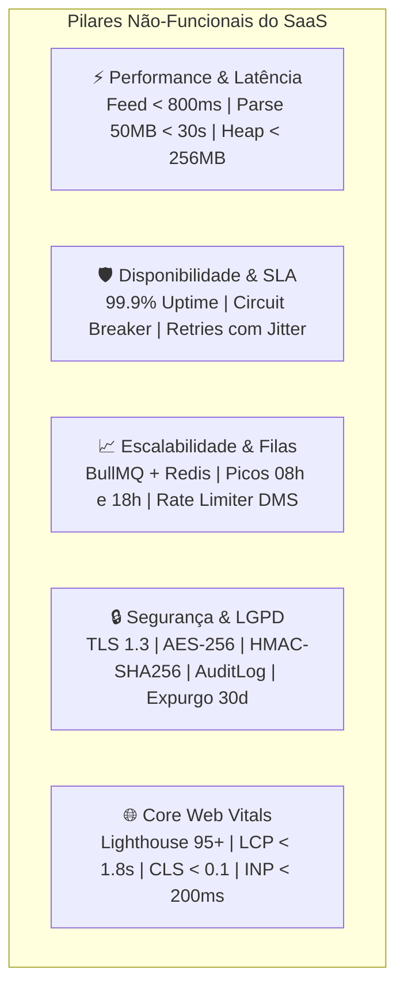
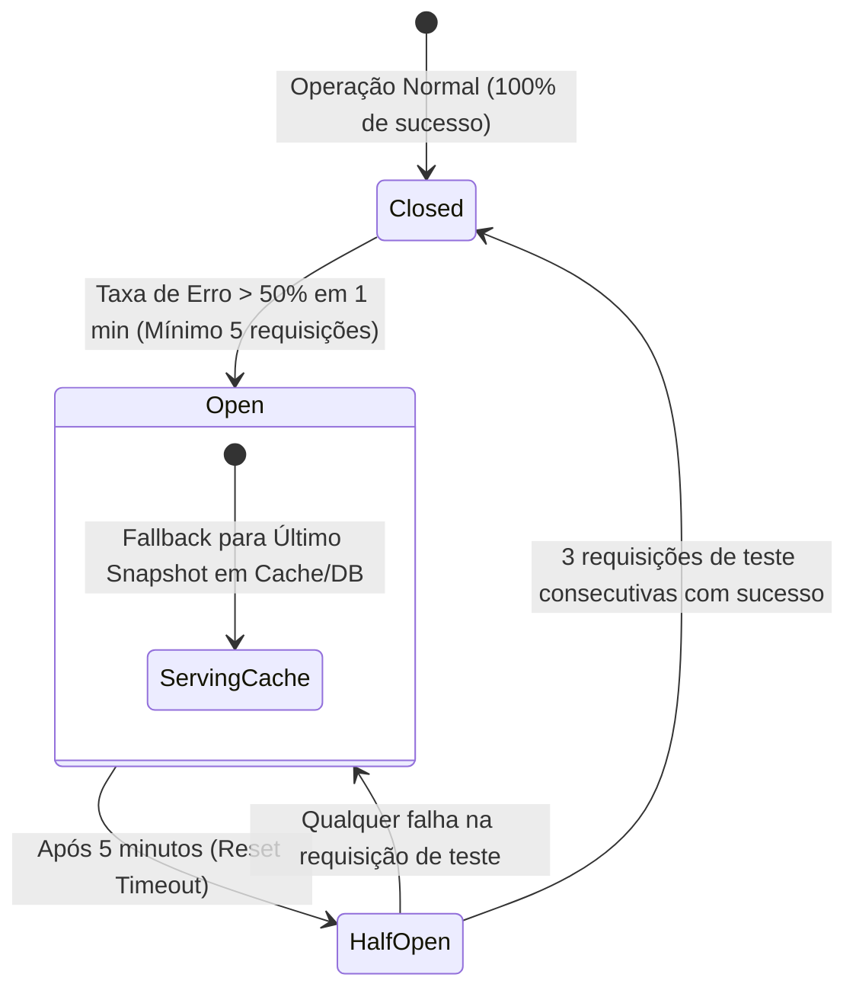
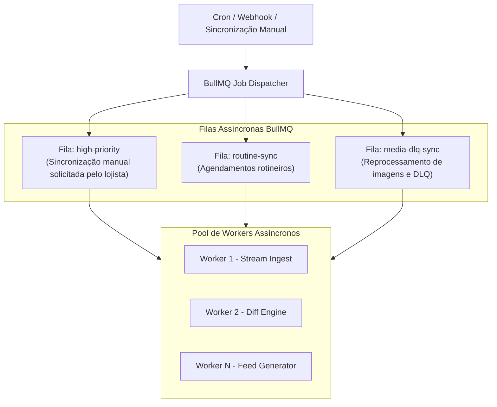

# ⚡ Especificação de Requisitos Não-Funcionais (RNFs), Performance, SLA e Segurança

> **Documento de Engenharia de Requisitos Não-Funcionais — SaaS Auto Catálogo**  
> **Referência:** Issue [#5 - [Task][Specs] Engenharia de Requisitos Não-Funcionais (RNFs), Performance, SLA e Segurança](https://github.com/saas-auto-catalogo/.github/issues/5)  
> **Status:** Aprovado / Baseline de Engenharia  
> **Última Atualização:** 2026-08-31  

---

## 1. Visão Geral e Matriz de Metas Não-Funcionais

O **SaaS Auto Catálogo** processa volumes massivos de inventários automotivos diariamente e atua como ponte crítica para orçamentos de mídia de alta relevância no **Meta Automotive Inventory Ads (DAA)**. Instabilidades ou atrasos nos feeds geram rejeição de anúncios e desperdício de verba publicitária das revendas.

Esta especificação define os limites quantitativos de performance, disponibilidade, resiliência, escalabilidade, segurança e conformidade com a LGPD.



---

## 2. Performance, Latência e Gestão de Memória

### 2.1. Tabela de SLOs e Latências Alvo

| Componente / Operação | Métrica Alvo (p50) | Métrica Limite (p95) | Condição de Carga |
|---|---|---|---|
| **Feed Público Meta XML (`/api/v1/feeds/:token/meta-vehicles.xml`)** | `< 250ms` | `< 800ms` | Até 2.000 veículos com compressão GZIP e Cache Redis |
| **Streaming Parser XML (50MB+ / 5.000 veículos)** | `< 18s` | `< 30s` | Parsing SAX contínuo com `heap < 256MB` |
| **Diff Engine (Computação de Hash SHA-256 por veículo)** | `< 0.2ms` | `< 0.5ms` | Comparação de 5.000 veículos em `< 2.5s` de CPU |
| **APIs REST Internas (`backend-api` Dashboard/Listagens)** | `< 60ms` | `< 150ms` | Consultas paginadas multi-tenant com índices compostos |
| **Simulador de Criativo de Anúncio (`frontend-app`)** | `< 100ms` | `< 200ms` | Renderização dinâmica de preview de criativo do Facebook/Instagram |

---

### 2.2. Streaming Parser XML & Limite Estrito de Memória (`heap < 256MB`)
Para evitar estouro de memória (Out-Of-Memory / OOM) ao processar feeds pesados de concessionárias e grandes portais:
1. **Abordagem SAX por Eventos**: É expressamente proibido o uso de parsers DOM baseados em árvore completa em memória (como `xml2js` tradicional sem stream).
2. **Chunking e Coleta de Lixo (GC)**:
   - Cada elemento de veículo (`<veiculo>` ou `<anuncio>`) é lido via stream, emitido pelo evento `on('data')`, convertido para o formato intermediário e imediatamente enviado para a fila de persistência / hash.
   - O objeto de cada veículo é desalocado imediatamente após o processamento, mantendo o consumo de Heap estável abaixo de `256MB` mesmo em arquivos de 100MB+.

```typescript
// Padrão arquitetural de streaming parser com controle de memória
import { createReadStream } from 'fs';
import sax from 'sax';

export async function parseLargeXmlFeedStream(
  filePath: string,
  onVehicleParsed: (vehicleData: any) => Promise<void>
): Promise<void> {
  const fileStream = createReadStream(filePath, { highWaterMark: 64 * 1024 }); // Chunks de 64KB
  const saxStream = sax.createStream(true, { trim: true, normalize: true });

  let currentVehicle: Record<string, any> | null = null;
  let currentTag = '';

  saxStream.on('opentag', (node) => {
    currentTag = node.name.toLowerCase();
    if (currentTag === 'veiculo' || currentTag === 'anuncio') {
      currentVehicle = {};
    }
  });

  saxStream.on('text', (text) => {
    if (currentVehicle && currentTag) {
      currentVehicle[currentTag] = (currentVehicle[currentTag] || '') + text;
    }
  });

  saxStream.on('closetag', async (tagName) => {
    const closed = tagName.toLowerCase();
    if ((closed === 'veiculo' || closed === 'anuncio') && currentVehicle) {
      saxStream.pause();
      await onVehicleParsed(currentVehicle);
      currentVehicle = null; // Libera imediatamente para o GC
      saxStream.resume();
    }
  });

  await new Promise((resolve, reject) => {
    fileStream.pipe(saxStream).on('end', resolve).on('error', reject);
  });
}
```

---

## 3. Disponibilidade, SLA e Resiliência de Integrações

### 3.1. Meta de SLA e Janela de Downtime
- **SLA Alvo de Disponibilidade**: **`99.9%` de uptime mensal** para os endpoints públicos de distribuição de feed (`/api/v1/feeds/:token/meta-vehicles.xml`).
- **Orçamento de Erro (Error Budget)**: Máximo de **43.8 minutos de indisponibilidade por mês**.

### 3.2. Estratégia de Retry com Exponential Backoff e Full Jitter
Para lidar com instabilidades transitórias em servidores de DMSs parceiros:
$$\text{Delay} = \text{random}(0, \min(\text{maxDelay}, \text{initialDelay} \times 2^{\text{attempt}}))$$
- **Tentativas Máximas**: 4 tentativas.
- **Delay Inicial**: 2 segundos.
- **Delay Máximo**: 60 segundos.
- **Fator Jitter**: Aleatoriedade completa para evitar o efeito "Manada Faminta" (*Thundering Herd*) sobre o DMS.

### 3.3. Circuit Breaker para DMSs Parceiros
Quando um DMS externo apresenta falhas consecutivas:



- **Graceful Fallback**: Se o DMS estiver em estado `OPEN`, a sincronização agendada é adiada, mas o **Feed Meta continua servindo o último inventário válido armazenado no PostgreSQL e no Redis**, garantindo que as campanhas de tráfego pago dos clientes permaneçam ativas sem pausas indevidas.

---

## 4. Escalabilidade e Processamento Assíncrono com BullMQ

### 4.1. Dimensionamento para Horários de Pico
As revendas e concessionárias no Brasil concentram alterações de estoque nos horários de abertura e fechamento comercial:
- **Pico Matutino**: 08h00 às 09h30.
- **Pico Vespertino**: 17h30 às 19h00.

Para garantir que centenas de sincronizações simultâneas sejam processadas sem degradação:



### 4.2. Rate Limiting por Host de DMS
Muitos DMSs legados utilizam servidores locais ou hospedagens compartilhadas com baixa capacidade. O `backend-api` implementa um **Rate Limiter distribuído por Host no Redis**:
- Máximo de **3 requisições concorrentes por domínio de DMS**.
- As demais tarefas para o mesmo domínio aguardam em fila sem derrubar o servidor da revenda.

---

## 5. Segurança, Criptografia e Conformidade LGPD

### 5.1. Criptografia em Trânsito e em Repouso
- **Em Trânsito**: Obrigatório **TLS 1.3** (com fallback mínimo para TLS 1.2) com curvas elípticas modernas (ECDHE-ECDSA-AES128-GCM-SHA256) e cabeçalho `Strict-Transport-Security` (HSTS com `max-age=31536000; includeSubDomains; preload`).
- **Em Repouso**: Banco de dados PostgreSQL gerenciado com criptografia **AES-256** ativada em disco e em backups automáticos.

### 5.2. Hashing Criptográfico de Tokens
- Tokens de acesso público a feeds utilizam chave HMAC com algoritmo **SHA-256** combinada com **Salt criptográfico exclusivo por tenant** (armazenado em coluna dedicada).
- Rotação com **Janela de Tolerância de 48 horas** para impedir quebra de sincronização com o Meta Ads.

### 5.3. Conformidade com a Lei Geral de Proteção de Dados (LGPD - Lei nº 13.709/2018)
1. **Minimização de Dados**: Feeds de estoque contêm exclusivamente dados de bens comerciais (veículos). Nenhum dado pessoal do comprador anterior é armazenado.
2. **Ofuscação de Placas**: Suporte a máscaras ou ocultação de caracteres de placas para revendas que não desejam exibição pública da placa em anúncios.
3. **Expurgo Automático de Logs e Payloads (Data Retention)**:
   - Registros de `FeedSyncLog` e payloads brutos armazenados temporariamente para auditoria são **expurgados automaticamente após 30 dias** através de job de retenção diário.
4. **Direito ao Esquecimento e Purge de Tenant**:
   - Ao cancelar uma conta, o lojista pode solicitar a exclusão de todos os dados. O sistema executa um *Hard Delete* em cascata em todas as tabelas segregadas por `workspace_id`.

---

## 6. Core Web Vitals e Performance Frontend

O site institucional e blog (`marketing-site-blog`), desenvolvido em **Next.js 15 / Astro**, segue metas rigorosas de SEO e experiência do usuário (Google PageSpeed / Lighthouse):

```mermaid
flowchart LR
    Browser[Navegador / Googlebot] --> Cloudflare[Cloudflare Edge CDN / Cache]
    Cloudflare --> ISR[Next.js 15 ISR / Astro Static HTML]
    ISR --> Render[LCP < 1.8s | CLS < 0.1 | INP < 200ms]
```

### 6.1. Metas Oficiais de Core Web Vitals

| Métrica Web | Meta SaaS Auto Catálogo | Limite Máximo Recomendado pelo Google | Estratégia de Otimização |
|---|---|---|---|
| **LCP (Largest Contentful Paint)** | `< 1.8s` | `< 2.5s` | Priorização de hero images, pré-conexão de CDN e fonte otimizada (`next/font`) |
| **CLS (Cumulative Layout Shift)** | `< 0.05` | `< 0.1` | Dimensões de imagens e banners declaradas explicitamente com aspect-ratio |
| **INP (Interaction to Next Paint)** | `< 150ms` | `< 200ms` | Minimização de JavaScript no main-thread, lazy hydration de componentes interativos |
| **TTFB (Time to First Byte)** | `< 180ms` | `< 800ms` | Caching estático em borda (Edge CDN) e geração estática incremental (ISR) |
| **Pontuação Google Lighthouse** | **95+** | >= 90 | Otimização contínua de performance, acessibilidade, SEO e boas práticas |
