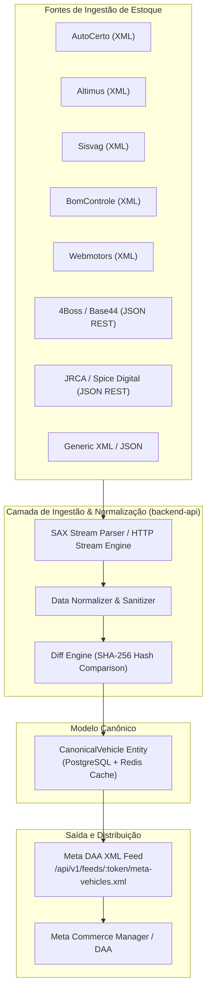
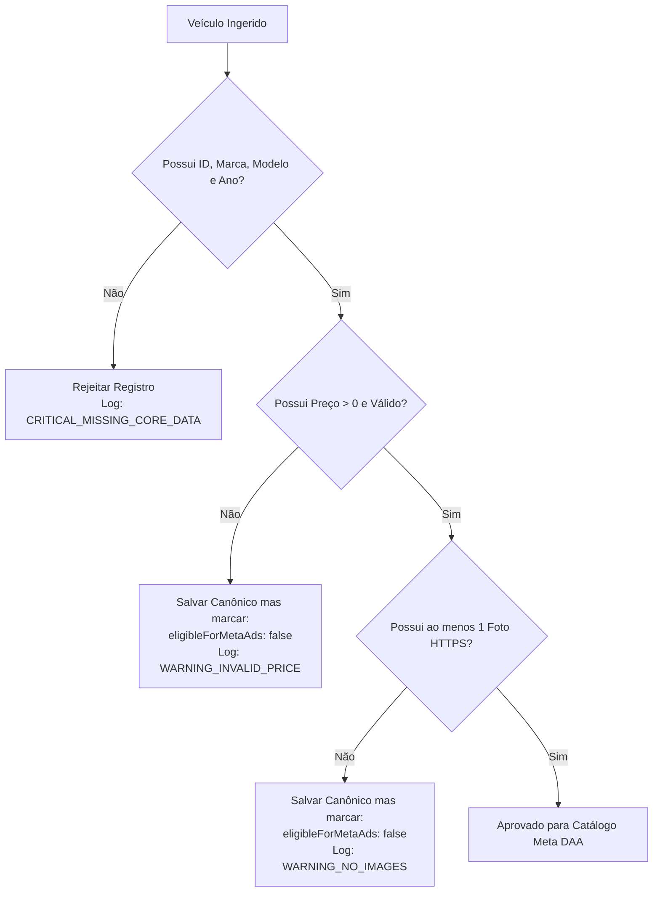

# 📖 Levantamento de Schemas, Dicionário de Dados e Mapeamento de Feeds Automotivos

> **Documento de Especificação Técnica — DriveSync (SaaS Auto Catálogo)**  
> **Referência:** Issue [#2 - [Task][Specs] Levantamento e Dicionário de Schemas XML de Estoque Automotivo](https://github.com/saas-auto-catalogo/.github/issues/2)  
> **Status:** Aprovado / Baseline de Engenharia  
> **Última Atualização:** 2026-08-31  

---

## 1. Visão Geral da Ingestão Multicanal

O **DriveSync** atua como uma camada de sincronização e inteligência de dados entre sistemas heterogêneos de gestão de pátio/DMSs de revendas e concessionárias no Brasil e as plataformas de anúncios dinâmicos, com foco prioritário no **Meta Automotive Inventory Ads (DAA)** (Facebook e Instagram).

Para garantir escalabilidade, idempotência e integridade na geração dos catálogos, toda fonte de dados (seja um stream XML tradicional ou uma API REST/JSON moderna) é ingerida através de um adaptador dedicado e convertida para o modelo canônico unificado: **`CanonicalVehicle`**.

---

## 2. Análise Estrutural das Fontes Mapeadas

### 2.1. Provedores XML Tradicionais do Mercado Brasileiro

#### 1. AutoCerto
- **Raiz e Hierarquia**: `<estoque><veiculos><veiculo>...</veiculo></veiculos></estoque>`.
- **Identificação**: Tag `<codigo>` (ex: `AC-84920`), `<placa>`, `<chassi>`.
- **Fotos**: Nó `<fotos>` contendo múltiplos elementos `<foto>https://img.autocerto.com/...</foto>`. A primeira ocorrência é assumida como foto principal.
- **Opcionais**: Nó `<opcionais>` contendo múltiplos nós `<opcional>Texto do Opcional</opcional>`.
- **Preço**: Tag `<preco>` e opcionalmente `<preco_promocional>`.

#### 2. Altimus
- **Raiz e Hierarquia**: `<altimus><estoque><veiculo>...</veiculo></estoque></altimus>`.
- **Identificação**: Tag `<id>` (inteiro) e `<codigo_estoque>`.
- **Fotos**: Nó `<fotos>` com elementos estruturados via atributos XML: `<foto ordem="1" principal="sim" url="..." />`.
- **Transmissão e Combustível**: Tags `<transmissao>` (ex: "CVT", "Manual") e `<combustivel>` (ex: "Gasolina e Álcool").
- **Blindagem**: Tag `<blindado>` com valores "sim" ou "nao".

#### 3. Sisvag
- **Raiz e Hierarquia**: `<sisvag_estoque><veiculos><veiculo>...</veiculo></veiculos></sisvag_estoque>`.
- **Encoding Frequente**: Comumente emitido em `ISO-8859-1` ou `Windows-1252`.
- **Identificação**: Tag `<codigo_veiculo>`.
- **Fotos**: Múltiplos nós `<fotos><foto>...</foto></fotos>`.
- **Opcionais**: Tag `<itens_serie>` contendo nós `<item>...</item>`.
- **Preço**: Tag `<valor>` com formato monetário `178900.00`.

#### 4. BomControle (ERP / CRM Automotivo)
- **Raiz e Hierarquia**: `<bomcontrole_erp><veiculos><veiculo>...</veiculo></veiculos></bomcontrole_erp>`.
- **Identificação**: Tag `<id>` (ex: `BC-VEC-5521`) e `<codigo_interno>`.
- **Fotos**: Nó `<imagens>` com elementos `<imagem ordem="1" destaque="true">https://...</imagem>`.
- **Status Comercial**: Tag `<status_comercial>` com valores como `DISPONIVEL`, `RESERVADO`, `VENDIDO`.
- **Opcionais**: Tag `<caracteristicas>` contendo nós `<item>...</item>`.

#### 5. Webmotors (Padrão Integrador)
- **Raiz e Hierarquia**: `<anuncios><anuncio>...</anuncio></anuncios>`.
- **Identificação**: Tag `<codigo_anuncio>` (ex: `WM-981240`).
- **Fotos**: Nó `<fotos><foto principal="true" url="..." /></fotos>`.
- **Opcionais**: Tag `<opcionais><opcional>...</opcional></opcionais>`.
- **Blindagem**: Valores textuais como "SIM" ou "NÃO".

---

### 2.2. Feeds Reais JSON / REST em Produção

#### 1. 4Boss / Base44 (`https://www.4boss.com.br/api/vehicles`)
- **Arquitetura**: Endpoint JSON REST que retorna `{ "vehicles": [ ... ] }`.
- **Amostra de Dados**: Especializada em veículos premium e superesportivos (Ferrari, Porsche, Mercedes-AMG, Corvette, Range Rover).
- **Campos de Destaque**:
  - `price` ("489.700") e `priceRaw` (`489700`) — ambos em Reais sem centavos.
  - `km` ("4.686") e `kmRaw` (`4686`).
  - `year` ("2025/2026") — string combinada de fabricação e modelo.
  - `photos` — array de strings com URLs no CDN `base44.app` em altíssima resolução.
  - `heroImage` / `image` — foto principal e foto de destaque.
  - `color`, `corExterna`, `corInterna` — separação expressa de tons externos e internos.
  - `notes` — texto estruturado com ficha técnica completa em letras maiúsculas.
  - `options` — array simples de strings (`["Air Bag", "Alarme", ...]`).
  - `armored` — booleano nativo (`false` ou `true`).
  - `plate` — placa informada (ex: `TYN9F21`).

#### 2. JRCA Seminovos / Spice Digital (`https://www.jrcaseminovos.com.br/api/vehicles`)
- **Arquitetura**: Endpoint JSON REST paginado `{ "total": 136, "pages": 12, "page": 1, "perPage": 12, "vehicles": [ ... ] }`.
- **Amostra de Dados**: Estoque multimarca seminovos com alto volume de veículos eletrificados (Audi TFSIe, BYD Dolphin, Song Plus, King).
- **Campos de Destaque**:
  - `year`: Objeto estruturado `{ "one": 2023, "two": 2024 }` onde `one` = ano de fabricação e `two` = ano do modelo.
  - `price`: Numérico direto em Reais (`289990`).
  - `priceOnRequest`: Booleano indicando preço sob consulta.
  - `exchange`: Câmbio denominado como `exchange: "Automático"`.
  - `galleryMedium` e `gallerySmall`: Arrays de objetos de mídia contendo `{ url, full, alt }`.
  - `warranty` e `warrantyText`: Flag e texto de garantia de fábrica.
  - `armored`: Booleano nativo.

---

## 3. Matriz De-Para Unificada

| Propriedade Canônica (`CanonicalVehicle`) | Tipo | 4Boss (Base44) | JRCA (Spice Digital) | AutoCerto XML | Altimus XML | Sisvag XML | BomControle XML | Webmotors XML |
|---|---|---|---|---|---|---|---|---|
| **`externalId`** | `string` | `vid` \|\| `id` | `id` (to string) | `<codigo>` | `<id>` | `<codigo_veiculo>` | `<id>` | `<codigo_anuncio>` |
| **`make`** | `string` | `brand` | `brand` | `<marca>` | `<fabricante>` | `<marca>` | `<marca>` | `<marca>` |
| **`model`** | `string` | `short` \|\| `model` | `model` | `<modelo>` | `<modelo>` | `<modelo>` | `<modelo>` | `<modelo>` |
| **`version`** | `string` | `version` | `version` | `<versao>` | `<versao>` | `<versao>` | `<versao>` | `<versao>` |
| **`title`** | `string` | Gerado / `display` | `title` | Gerado (`marca` + `modelo` + `ano`) | Gerado | Gerado | Gerado | Gerado |
| **`bodyStyle`** | `BodyStyle` | Inferido de `model`/`notes` | Inferido de `model` | `<carroceria>` \|\| Inferido | Inferido | Inferido | `<categoria>` \|\| Inferido | Inferido |
| **`manufactureYear`** | `number` | `year` (split `/`[0]) | `year.one` | `<anofabricacao>` | `<ano_fabricacao>` | `<ano_fabricacao>` | `<ano>` | `<ano_fabricacao>` |
| **`modelYear`** | `number` | `year` (split `/`[1] \|\| [0]) | `year.two` | `<anomodelo>` | `<ano_modelo>` | `<ano_modelo>` | `<ano_modelo>` | `<ano_modelo>` |
| **`doors`** | `number` | `doors` (to int) | Inferido (4 padrão) | `<portas>` | `<portas>` | `<qtd_portas>` | `<portas>` | `<portas>` |
| **`colors.exterior`** | `string` | `corExterna` \|\| `color` | Extraído de `title` | `<cor>` | `<cor>` | `<cor>` | `<cor>` | `<cor>` |
| **`colors.interior`** | `string` | `corInterna` | N/A | N/A | N/A | N/A | N/A | N/A |
| **`mileage`** | `number` | `kmRaw` \|\| `km` | `km` | `<quilometragem>` | `<km>` | `<km>` | `<quilometragem>` | `<quilometragem>` |
| **`fuelType`** | `FuelType` | `fuel` | `fuel` | `<combustivel>` | `<combustivel>` | `<tipo_combustivel>` | `<combustivel>` | `<combustivel>` |
| **`transmission`** | `TransmissionType`| `transmission` | `exchange` | `<cambio>` | `<transmissao>` | `<tipo_cambio>` | `<cambio>` | `<transmissao>` |
| **`armored`** | `boolean` | `armored` | `armored` | `<blindado>` | `<blindado>` | `<blindado>` | `<blindado>` | `<blindado>` |
| **`pricing.price`** | `number` | `priceRaw` \|\| `price` | `price` | `<preco>` \|\| `<valor>` | `<preco_venda>` | `<valor>` | `<valor_venda>` | `<preco>` |
| **`pricing.promotionalPrice`** | `number` | N/A | N/A | `<preco_promocional>`| N/A | N/A | N/A | `<preco_promocional>`|
| **`pricing.priceOnRequest`** | `boolean` | `false` | `priceOnRequest` | `false` | `false` | `false` | `false` | `false` |
| **`condition`** | `VehicleCondition`| `km == 0` ? NOVO : SEMINOVO | `km <= 50` ? NOVO : SEMINOVO | `km == 0` ? NOVO : USADO | Por KM | Por KM | Por KM | Por KM |
| **`status`** | `VehicleStatus` | `AVAILABLE` | `AVAILABLE` | `AVAILABLE` | `AVAILABLE` | `AVAILABLE` | `<status_comercial>` | `AVAILABLE` |
| **`images`** | `VehicleImage[]` | `photos` \|\| `image` | `galleryMedium[].full`| `<fotos><foto>` | `<fotos><foto url>` | `<fotos><foto>` | `<imagens><imagem>` | `<fotos><foto url>` |
| **`heroImageUrl`** | `string` | `heroImage` \|\| `image` | `galleryMedium[0].full`| `<fotos><foto>[0]`| `<foto principal="sim">`| `<fotos><foto>[0]`| `<imagem destaque="true">`| `<foto principal="true">`|
| **`features`** | `string[]` | `options` | Inferido de `title` | `<opcionais><opcional>`| `<opcionais><opcional>`| `<itens_serie><item>`| `<caracteristicas><item>`| `<opcionais><opcional>`|
| **`description`** | `string` | Sanitizado de `notes` | `title` + `version` | `<observacoes>` | `<descricao>` | `<detalhes>` | `<informacoes_adicionais>`| `<descricao>` |
| **`notes`** | `string` | `notes` | N/A | `<observacoes>` | `<descricao>` | `<detalhes>` | `<informacoes_adicionais>`| `<descricao>` |
| **`licensePlate`** | `string` | `plate` | N/A | `<placa>` | `<placa>` | `<placa>` | `<placa>` | `<placa>` |
| **`vin`** | `string` | N/A | N/A | `<chassi>` | `<chassi>` | `<chassi>` | `<chassi>` | `<chassi>` |
| **`canonicalUrl`** | `string` | `https://www.4boss.com.br/veiculo/...` | `slug` | `<url_anuncio>` | `<url>` | `<link_direto>` | `<url_estoque>` | `<url_anuncio>` |

---

## 4. Regras de Normalização e Sanitização

### 4.1. Anos de Fabricação e Modelo (`manufactureYear` e `modelYear`)
1. **Estrutura com Objeto**: Se for `{ "one": 2023, "two": 2024 }`, atribuir `manufactureYear = 2023` e `modelYear = 2024`.
2. **String Combinada ("2024/2025" ou "2024-2025")**:
   - Extrair primeiro token: `2024` -> `manufactureYear`.
   - Extrair segundo token: `2025` -> `modelYear`.
3. **String de 2 Dígitos ("24/25")**:
   - Mapear para século 21: `2024` e `2025`.
4. **Ano Único ("2024")**:
   - Atribuir `manufactureYear = 2024` e `modelYear = 2024`.
5. **Validação de Sanidade**: `1950 <= year <= (ano_atual + 2)`. Caso contrário, registrar `validationWarning`.

### 4.2. Valores Monetários e Precificação (`pricing.price`)
1. **Tipos Numéricos Diretos (`289990` ou `489700.00`)**: Converter para float com duas casas decimais (`289990.00`).
2. **Strings com Formatação Brasileira ("R$ 149.900,00" ou "149.900,00")**:
   - Remover "R$", espaços, e pontos de milhar (`.`).
   - Substituir vírgula decimal (`,`) por ponto (`.`).
   - Exemplo: `"R$ 149.900,00"` -> `149900.00`.
3. **Strings com Notação de Milhar em Ponto ("489.700")**:
   - Identificar ausência de centavos e tratar como `489700.00`.
4. **Regra de Exportação Meta DAA**:
   - Se `price <= 0` ou `priceOnRequest === true`, o veículo **não deve ser incluído no catálogo XML final da Meta**, pois o Commerce Manager rejeita anúncios com preço zerado ou ausente.

### 4.3. Quilometragem (`mileage`)
1. **Inteiro Direto (`17881`)**: Usar valor absoluto.
2. **String Formatada ("4.686 km" ou "4.686")**:
   - Remover "km", "KM", espaços e pontos.
   - Exemplo: `"4.686"` -> `4686`.
3. **Valores Menores que 100 km**: Considerar estado `NOVO` se ano do modelo for o atual/subsequente.

### 4.4. Tabela de Mapeamento de Combustíveis (`FuelType`)

| Termos Encontrados nos Feeds (Aliases / Regex) | Enum Canônico (`FuelType`) |
|---|---|
| `"flex"`, `"total flex"`, `"gasolina e álcool"`, `"gasolina/álcool"`, `"bi-combustível"`, `"flexstar"` | `FLEX` |
| `"gasolina"`, `"gasoline"` | `GASOLINA` |
| `"etanol"`, `"álcool"`, `"alcohol"` | `ETANOL` |
| `"diesel"`, `"turbo diesel"`, `"turbodiesel"` | `DIESEL` |
| `"híbrido"`, `"hibrido"`, `"hybrid"` | `HIBRIDO` |
| `"híbrido plug-in"`, `"phev"`, `"gasolina e elétrico"`, `"e-hybrid"`, `"tfsie"` | `HIBRIDO_PLUG_IN` |
| `"mhev"`, `"híbrido leve"`, `"mild hybrid"`, `"48v"` | `MHEV_HIBRIDO_LEVE` |
| `"elétrico"`, `"eletrico"`, `"electric"`, `"ev"` | `ELETRICO` |
| `"gnv"`, `"gás natural"`, `"gas"` | `GNV` |
| `"tetrafuel"` | `TETRAFUEL` |
| Qualquer outro ou ausente | `OUTRO` |

### 4.5. Tabela de Mapeamento de Transmissão (`TransmissionType`)

| Termos Encontrados nos Feeds (Aliases / Regex) | Enum Canônico (`TransmissionType`) |
|---|---|
| `"automática"`, `"automático"`, `"aut."`, `"tiptronic"`, `"steptronic"`, `"9g-tronic"`, `"s.tr."`, `"zf"` | `AUTOMATICO` |
| `"dupla embreagem"`, `"pdk"`, `"f1-dct"`, `"dsg"`, `"dct"`, `"s-tronic"` | `DUPLA_EMBREAGEM` |
| `"cvt"`, `"xtronic"`, `"direct-shift cvt"` | `CVT` |
| `"automatizado"`, `"i-motion"`, `"dualogic"`, `"easytronic"` | `AUTOMATIZADO` |
| `"manual"`, `"mecânico"`, `"mecanico"` | `MANUAL` |
| Qualquer outro ou ausente | `OUTRO` |

### 4.6. Imagens e Fotos
1. **Validação de Protocolo**: Apenas URLs iniciando em `https://` são aceitas. Se fornecido `http://`, realizar upgrade automático para `https://` se suportado pelo domínio CDN.
2. **Resoluções e Thumbnails**:
   - Caso o feed forneça variantes (ex: `galleryMedium` vs `gallerySmall` ou `full` vs `url`), **sempre priorizar a versão de mais alta resolução (`full`)**.
3. **Ordenação e Capa**:
   - Se houver flag expressa (`principal="sim"`, `destaque="true"`, `heroImage`), esta imagem recebe `order: 1` e `isPrimary: true`.
   - Caso contrário, o primeiro item do array de fotos é atribuído como capa.
4. **Deduplicação**: Filtrar URLs idênticas consecutivas na mesma galeria.

### 4.7. Sanitização de Textos e Opcionais
1. **Normalização de Opcionais (`features`)**:
   - Conversão para caixa alta sem acentuação (ex: `"Ar Condicionado Digital"` -> `"AR_CONDICIONADO_DIGITAL"`).
   - Mapeamento para dicionário canônico de features (ex: `AR_CONDICIONADO`, `DIRECAO_ELETRICA`, `FREIOS_ABS`, `AIRBAG_DUPLO`, `TETO_SOLAR`, `BANCOS_COURO`, `CAMERA_RE`, `CAMERA_360`, `PILOTO_AUTOMATICO_ACC`, `RODAS_LIGA_LEVE`, `BLINDADO`).
2. **Descrições (`description`)**:
   - Remoção de tags HTML/scripts (`strip_tags`).
   - Normalização de quebras de linha duplas.
   - Limite de 5.000 caracteres para compatibilidade com a especificação do Meta Catalog.

---

## 5. Resiliência, Streaming Parser e Tratamento de Falhas

### 5.1. Streaming Parser de Baixo Consumo de Memória
Feeds XML de grandes revendas ou portais podem conter mais de 5.000 veículos e ultrapassar 50MB. Para atender ao RNF de **heap < 256MB**:
- O parser de backend utiliza uma abordagem **SAX baseada em streams** (`sax-js` ou `node-xml-stream`).
- Cada nó `<veiculo>` ou `<anuncio>` é parseado e emitido individualmente via evento `on('data', vehicleHandler)`.
- O payload de cada veículo é processado, computado o hash SHA-256 e imediatamente liberado para Garbage Collection.

### 5.2. Tratamento de Caracteres Especiais e Encodings Heterogêneos
1. **Caractere `&` não escapado**:
   - É muito comum revendas cadastrarem nomes como "Pick-up 4x4 & Cia" ou "Pneus & Rodas" sem o escape `&amp;`.
   - O pré-processador de stream aplica um regex de sanitização: `&(?!(amp|lt|gt|quot|apos|#\d+|#x[0-9a-fA-F]+);)` substituindo por `&amp;`.
2. **Detecção de Charset**:
   - O cabeçalho HTTP `Content-Type` e a declaração `<?xml encoding="..."?>` são lidos.
   - Caso seja identificado `ISO-8859-1` ou `Windows-1252`, um stream `iconv-lite` decodifica os bytes para `UTF-8` antes do analisador sintático.

### 5.3. Classificação de Falhas: Erro Fatal vs Warning de Validação

- **Erro Fatal (Descarte do Item)**:
  - Falta de identificador (`externalId` ou `codigo`).
  - Ausência simultânea de marca e modelo.
  - Payload corrompido que impede a conversão básica.
- **Aviso Não-Fatal (Registro no Banco com Restrição de Exportação)**:
  - Preço sob consulta ou zero (`price <= 0`): Salvo no SaaS para gestão interna, mas excluído da saída do Meta DAA.
  - Ausência de fotos: Salvo no SaaS, mas retido da exportação até que a revenda adicione imagens.
  - Quilometragem em branco: Assumido `0` se ano for o corrente, emitindo aviso de validação.

### 5.4. Dead Letter Queue (DLQ) e Trilha de Auditoria
Todos os erros e avisos de parsing são registrados na tabela `FeedIngestionLog` associados ao `workspaceId`, permitindo que o time de suporte no **backoffice-app** e o lojista no **frontend-app** visualizem exatamente quais veículos falharam e qual ação corretiva é necessária no DMS de origem.
